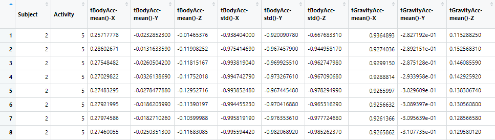
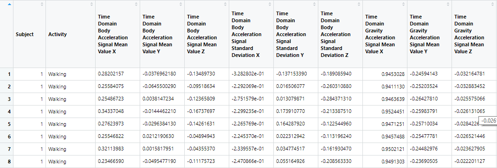
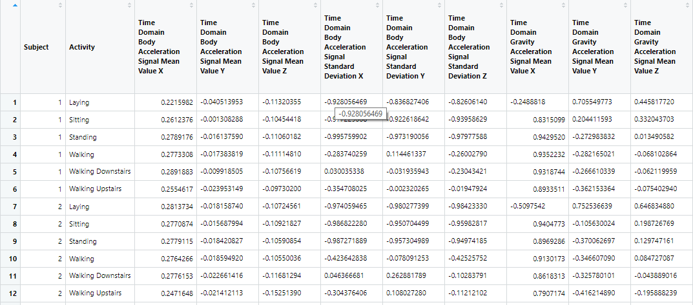

## **Readme Documentation**

This markdown document details the process taken to extract, merge, reformat, and clean a series of [raw measurement data](https://d396qusza40orc.cloudfront.net/getdata%2Fprojectfiles%2FUCI%20HAR%20Dataset.zip) collected from a [**Human Activity Recognition**](http://archive.ics.uci.edu/ml/datasets/Human+Activity+Recognition+Using+Smartphones) study conducted by **UC Irvine**.

The **"run_analysis.R"** script is supposed to be run in the same root directory as the file containing the raw data, this is reflected in the file directory arguments in the **read.table** commands, and as such modifications to the directory arguments is required if it is desired to run the script with a different working directory setup. 

The raw data is contained in a number of .txt files located within the project root directory and its subdirectories. The relevant .txt files were read using R's **read.table** function to create raw data.frame objects.
<br/><br/>

#### **Reading the .txt files**
```{r}
if (!exists("X_train")) {
  X_train <- read.table("train/X_train.txt")
}
```
All relevant raw data were read using a command similar to above. To save runtime on consecutive script runs, the **if statement** checks if the data.frame object already exists from previous script runs and only reads if the object does not exist.  

The raw data are read into the following data.frame objects in the workspace:

* **features** - Contains variable names corresponding to the columns found in **X_train** and **X_test**.
* **X_train** - Raw sensor data from the training set of the study.
* **Y_train** - Numbers from 1~6 corresponding to 6 activities performed by subjects from the training set. Used to identify the corresponding activity to each observation in **X_train**, number of rows equal that of **X_train**.
* **X_test** - Similar to **X_train** but for the test set of the study.
* **Y_test** - Similar to **Y_train** but for the test set of the study.
* **subject_train** - Numbers corresponding to the 21 subjects from the training set. Identifies the corresponding subject to each observation in **X_train**, number of rows equal that of **X_train**.
* **subject_test** - Similar to **subject_train** but for the 9 subjects from the test set.
<br/><br/>

#### **Merging the test and training sets**
Dataframes from the test set and training set corresponding to each other (**X_train** & **X_test**, **Y_train** & **Y_test**, **subject_train** & **subject_test**) were vertically combined using **rbind** into **X_combined**, **Y_combined**, and **subject_combined**. 
```{r}
X_combined <- rbind(X_test, X_train)
Y_combined <- rbind(Y_test, Y_train)
subject_combined <- rbind(subject_test, subject_train)
```
The combined data is then merged horizontally to create a complete dataframe, **rough_df**, that contains all sensor data and their corresponding subjects and activities. 

In addition, placeholder variable names for **rough_df** is created with "**Subject**" and "**Activity**" corresponding to the first two columns created from **subject_combined** and **Y_combined** respectively, and variable names from **features** for the columns of **X_combined**. 
```{r}
rough_df <- data.frame(cbind(subject_combined, Y_combined, X_combined))
names(rough_df) <- c("Subject", "Activity", features[,2])
```
<br/><br/>

#### **Selecting mean and standard deviation data from rough_df**
Columns containing mean value and standard deviation data from **rough_df** are denoted with "**mean**" and "**std()**" in their variable names. Therefore the function **grep** is used to find index numbers of mean value and standard deviation columns to subset **rough_df** dataframe into a pruned dataframe, **pruned_df**, containing only mean value and standard deviation data columns as well as the **Subject** and **Activity** data columns. 
```{r}
pruned_df<-rough_df[c(1,2,grep("[ms][et][ad][n()]", names(rough_df)))]
```
The rows of **pruned_df** is then reordered with the **arrange** function from the **dplyr** package in ascending order by **Subject** then by **Activity**.
```{r}
pruned_df <- arrange(pruned_df, Subject, Activity)
```
<br/><br/>

#### **Naming activities with descriptive activity names**
The numbers in the **Activity** variable are replaced with their corresponding activity labels as described in "**activity_labels.txt**" in the root folder.
```{r}
pruned_df$Activity[pruned_df$Activity == "1"] <- "Walking"
pruned_df$Activity[pruned_df$Activity == "2"] <- "Walking Upstairs"
pruned_df$Activity[pruned_df$Activity == "3"] <- "Walking Downstairs"
pruned_df$Activity[pruned_df$Activity == "4"] <- "Sitting"
pruned_df$Activity[pruned_df$Activity == "5"] <- "Standing"
pruned_df$Activity[pruned_df$Activity == "6"] <- "Laying"
```
<br/><br/>

#### **Replacing placeholder variable names with descriptive variable names**
Much of the variable names from **features** are abbreviated or shortened, such as "*tBodyAcc*", "*fBodyGyro*", "*meanFreq*" etc., and therefore should be replaced with more descriptive variable names that at once convey the type and characteristics of the data contained within each bariable column and how they're different from other variable columns. 

With reference to the explanation given in "**features_info.txt**", key words and abbrevations in the placeholder variable names are substituted with descriptive variable names using the **sub** function. Examples of the substitutions include replacing "**tBody**" with "**Time Domain Body**", "**Gyro**" with "**Gyroscope**", "**Mag**" with "**Magnitude**", etc.
```{r}
names(pruned_df) <- sub("tBody", "Time Domain Body ", names(pruned_df))
names(pruned_df) <- sub("fBody", "Frequency Domain Body ", names(pruned_df))
names(pruned_df) <- sub("tGravity", "Time Domain Gravity ", names(pruned_df))
names(pruned_df) <- sub("fGravity", "Frequency Domain Gravity ", names(pruned_df))
names(pruned_df) <- sub("Acc", "Acceleration ", names(pruned_df))
names(pruned_df) <- sub("Jerk", "Jerk ", names(pruned_df))
names(pruned_df) <- sub("Gyro", "Gyroscope ", names(pruned_df))
names(pruned_df) <- sub("Mag", "Magnitude ", names(pruned_df))
names(pruned_df) <- sub("mean\\(\\)", "Signal Mean Value ", names(pruned_df))
names(pruned_df) <- sub("std\\(\\)", "Signal Standard Deviation ", names(pruned_df))
names(pruned_df) <- sub("meanFreq\\(\\)", "Signal Mean Frequency ", names(pruned_df))
names(pruned_df) <- gsub("-", "", names(pruned_df))
```
<br/><br/>
**Comparison between original placeholder variable names and new descriptive variable names: **
<br/>

**Placeholder Variable Names**

<br/>

**Descriptive Variable Names**

<br/><br/>
The new descriptive variable names provide much more information at a glance than the original placeholder variable names. It clarifies what abbreviations in the original variable names, such as "**Acc**", "**t**", and "**Gyro**", stands for whilst being grammatically correct.
<br/><br/>

#### **Creating a tidy data set**
The assignment requirements stated to "**create a second, independent tidy data set with the average of each variable for each activity and each subject**". In this project the statement is understood as creating a tidy data based on the mean value of every variable from every combination of **Subject** and **Activity**. Since there are 30 subjects and 6 activities, the final tidy data should have 180 rows. The final tidy data should retain the same number of columns as **pruned_df**.

In order to find the average value for every combination of **Subject** and **Activity**, **pruned_df** is to be split first by **Subject** and then by **Activity** using the **split** function.

**pruned_df** is first split by **Subject** into a large list, **subject_split**, which is a list of 30 dataframes, one for each subject. 
```{r}
subject_split <- split(pruned_df, pruned_df$Subject)
```

A **nested for loop** is to be iterated over **subject_split**; the outer loop further split each data frame in the large list by **Activity**, the inner loop finds the column mean for each **Activity**. Each iteration of the inner loop binds the resulting mean values to the final tidy data frame. 

The final data frame, **tidy_df**, is initialized via converting a 1x81 (81 is the number of variables) empty matrix into a dataframe. The columns in **tidy_data** still corresponds to those in **pruned_data**, albeit the values in **tidy_data** are the column mean values for each combination of **Subject** and **Activity**. The variable names of **pruned_df** is retained in **tidy_df**.

```{r}
tidy_df <- as.data.frame(matrix(ncol = 81))
names(tidy_df) <- names(pruned_df)
```

The outer loop iterates through each dataframe object, **subject_data**, in **subject_split**. **subject_data** is then split by **Activity** into a temporary large list, **activity_split**, of 6 dataframes, one for each activity. 
```{r}
for (subject_data in subject_split) {
  activity_split <- split(subject_data, subject_data$Activity)
```
The inner loop iterates through each dataframe object, **activity_data**, in **activity_split**, and calculates the column means for all the variable columns with the function **colMeans**. The resulting array is converted into a data frame with **as.data.frame** and then transposed into a row with the function **t**. The resulting row data frame is added to **tidy_df** with the function **rbind**.

```{r}
  for (activity_data in activity_split) {
      tidy_df <- rbind(tidy_df, cbind(activity_data[1,1:2], t(as.data.frame(colMeans(activity_data[1:length(activity_data[,1]), 3:length(activity_data[1,])])))))
  }
}
```

**tidy_df** is created once all iterations of the nested loop had been run. The empty 1st row, from the initialization of the data frame as an empty row matrix, is removed by subsetting **tidy_df**.
```{r}
tidy_df <- tidy_df[2:length(tidy_df[,1]),]
```
<br/><br/>

#### **Assessing the suitability of tidy_df as "Tidy Data"**
**Snapshot of tidy_df**

All tidy data, as described by Hadley Wickham in [Tidy Data](https://vita.had.co.nz/papers/tidy-data.pdf), have three characteristics:

* **Each variable forms a column**
* **Each observation forms a row**
* **Each type of observational unit forms a table**

In **tidy_df** every column corresponds to one of all the mean value and standard deviation variables recorded by sensors in the HAR study, as well as two columns that records the values for the **Subject** and **Activity** variables which defines every unique observation in **tidy_df**. Each column corresponds to one unique variable. In addition, column headers contain clear and descriptive variable names instead of raw values.  

Each row of **tidy_df** is an observation defined by a unique combination of a subject and an activity. Given 6 possible activities and 30 total subjects, there are 6x30 = 180 rows in **tidy_df**. There are no variables contained across any row in **tidy_df**.

Finally, the observational unit in this data tidying process is understood to be the combined set of the training and testing subject groups, hence a single data frame is produced in the final tidy data set. Although it is also valid should each subject to be understood as a single observation unit and there be a collection of 30 data frames, each for a subject, in this data tidying process it is opted for subject to be a variable rather than observation units to reduce the number of created loose files. 

As **tidy_df** fulfils the three requirements for tidy data, the author believes that it is sufficiently tidy for further data analysis.
<br/><br/>

#### **Exporting tidy_df**
**tidy_df** is written to disk as an excel file, "**tidy_df.csv**", with the **write.csv** function.
```{r}
write.csv(tidy_df, file = "tidy_df.csv")
```

